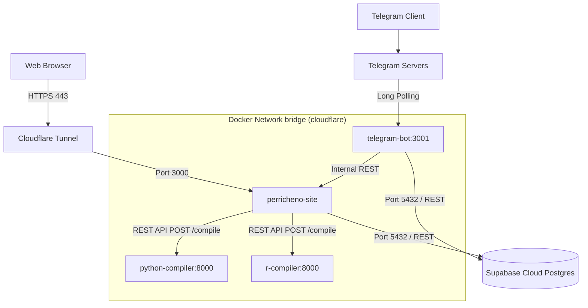

# Perricheno (Перичено) - Техническая Документация и Архитектура Проекта

В данном документе представлено исчерпывающее, высокодетализированное техническое описание внутренностей платформы Perricheno. Документация описывает архитектурные решения, схемы баз данных, контрактных спецификаций API, алгоритмы работы компиляторов и особенности интеграции с внешними системами. Этот документ является «Единой точкой истины» (Single Source of Truth) для любого разработчика или DevOps-инженера, работающего с данным продуктом.

---

## 1. Концепция и Технологический Стек

### 1.1 Бизнес-логика

Perricheno - автоматизированная система для генерации академических работ, проведения дата-аналитики и визуализации данных средствами искусственного интеллекта. Проект нацелен на студентов, аспирантов и исследователей, предлагая им:

- Умный текстовый редактор с поддержкой LaTeX-разметки.
- Генерацию сложной инфографики (диаграммы, тепловые карты) на основе "сырых" данных пользователя через реальное исполнение кода.
- Биллинг-систему на основе потребленных токенов (символов) с интеграцией крипто-оплаты.
- Кроссплатформенный интерфейс: Web-панель + интегрированный Telegram Bot.

### 1.2 Стек Технологий

- **Web Backend & Frontend**: Next.js 14 (App Router), React 18, TailwindCSS.
- **Telegram Bot**: Node.js, `telegraf` (Scene-based & Wizard State Management).
- **База данных**: Supabase (PostgreSQL 15), `@supabase/supabase-js`.
- **AI Models**: OpenAI (GPT-4o, GPT-3.5) и Grok Vision (для анализа изображений и OCR).
- **Code Execution Engines**: Изолированные контейнеры на базах `python:3.11-slim` и `r-base` (Plumber REST API / FastAPI).
- **Оплата**: CryptoCloud API (Webhooks-интеграция с MD5-сигнатурами).
- **Инфраструктура**: Docker, Docker Compose, Cloudflare Tunnels/Networks, Ubuntu 서버.

---

## 2. Глубокий Разбор Архитектуры Системы

Платформа спроектирована по микросервисному шаблону с единой точкой входа (Next.js Application), но с вынесением небезопасных или долгих вычислений в изолированные процессы (R/Python compilers, Telegram Bot polling).

### 2.1 Топология Сети и Контейнеров



**Суть изоляции (Sandboxing)**
AI генерирует программный код, который необходимо исполнить для визуализации. Выполнение сгенерированного кода на основном сервере `perricheno-site` критически уязвимо к атакам RCE (Remote Code Execution) и истощению ресурсов (бесконечные циклы). Для решения этой проблемы созданы `python-compiler` и `r-compiler`.

- Они не имеют проброшенных портов наружу (нет `ports: 8000:8000` в `docker-compose.yml`).
- Они доступны **только** для `perricheno-site` по локальным именам сети (`http://python-compiler:8000/`).
- Исполнение ограничено таймаутами на уровне API ядра компилятора.

---

## 3. Схема Базы Данных (Supabase PostgreSQL)

Все данные персистентно хранятся в Supabase. Доступ осуществляется через асинхронный клиент `supabase-js`, использующий `SERVICE_ROLE_KEY` для байпаса Row Level Security (RLS) на бэкенд вызовах.

### 3.1 Таблица `users`

Консолидирует профиль пользователя, связку с Telegram и данные текущих балансов.

* `id` (BIGINT, PK, Auto-increment) - внутренний системный ID.
* `telegram_id` (TEXT, UNIQUE, NOT NULL) - идентификатор из Telegram. Строковый тип предотвращает integer overflow (ID Telegram часто превышают 32-bit `int`).
* `username`, `first_name`, `photo_url` (TEXT) - кешируются для генерации аватарок.
* **Система Балансов**:
  * Параллельные счетчики: `daily_chars_used`, `weekly_chars_used`, `monthly_chars_used` (BIGINT) записывают "бесплатные"/регулярные издержки.
  * `purchased_chars` (BIGINT) - жесткий счетчик купленных сверх лимита символов через Cryptocloud. Вычитается скриптами, может уходить в отрицательные значения в пределах допустимого лимита обработки одной транзакции.
  * Аналогично настроены счетчики для генерации изображений: `daily_visuals_used` и `purchased_visuals`.
* `plan_tier` & `account_tier` (TEXT) - текущий уровень подписки (`free`, `plus`, `pro`, `ultra`). Влияют на лимиты контекста и приоритет в очередях.
* `last_reset_date`, `last_week_reset` (TEXT) - строковые значения дат (формат `YYYY-MM-DD`). Используются функцией `checkAndDeductUsage` для сброса daily счетчиков в нули.
* `is_banned`, `is_admin`, `is_deleted` (BOOLEAN).
* `referred_by` (BIGINT) - ID родительского пользователя в реферальной системе.

### 3.2 Таблица `agent_sessions`

Хранит результаты выполнения AI алгоритмов, генерирующих PDF, LaTeX и графики.

* `id` (TEXT, PK, UUID v4).
* `user_id` (BIGINT, FK -> `users.id`).
* `title` (TEXT).
* `doc_type` (TEXT).
* `settings_json` (TEXT) - JSON-строка конфигурации (содержит тип языка, промпт, стиль `phd|simple`, ссылки и загруженные исходники).
* `main_tex` (TEXT) - Сгенерированный код LaTeX.
* `references_bib` (TEXT) - Сгенерированный файл `.bib`.
* `visuals_json` (TEXT) - Метаданные графиков, включая Base64 закодированные png изображения и исходный R/Python код.
* `status` (TEXT) - стейт машина: `generating` -> (`done` | `error`).
* `stream_text` (TEXT) - буфер потоковой генерации. В процессе создания `GPT-4` отправляет Stream-Chunks, которые каждую долю секунды апсертятся сюда и поллятся фронтендом (SWR/React) для эффекта "печати".
* `share_id` (TEXT, UNIQUE) - короткий 8-символьный хэш для публичного шеринга страницы студентам.
* `tg_message_id` (BIGINT) - ID сообщения в Telegram боте "Ожидайте, ваш документ генерируется...". При обновлении статуса в таблице, бот редактирует это исходное сообщение на "Завершено", не отправляя новые пуши.

### 3.3 RPC-Функции Базы (Stored Procedures)

Для обеспечения строгой атомарности (ACID) при списании баланса используется PostgreSQL RPC функция `deduct_user_usage`. Это сделано для того, чтобы многопоточный бэкенд не создал "состояние гонки" (Race Condition), прочитав старый баланс во время одновременного запуска двух процессов генерации:

```sql
CREATE OR REPLACE FUNCTION deduct_user_usage(
    p_user_id BIGINT,
    p_free_deduction BIGINT,
    p_purchased_deduction BIGINT,
    p_amount BIGINT
) RETURNS void AS $$
BEGIN
    UPDATE users 
    SET 
        daily_chars_used = daily_chars_used + p_free_deduction,
        weekly_chars_used = weekly_chars_used + p_free_deduction,
        monthly_chars_used = COALESCE(monthly_chars_used, 0) + p_free_deduction,
        purchased_chars = purchased_chars - p_purchased_deduction
    WHERE id = p_user_id;

    IF p_amount > 0 THEN
        INSERT INTO transactions (user_id, topic, amount_text, is_positive)
        VALUES (p_user_id, 'Agent generation', '-' || p_amount || ' chars', false);
        INSERT INTO usage_logs (user_id, tokens) VALUES (p_user_id, p_amount);
    END IF;
END;
$$ LANGUAGE plpgsql;
```

Данная функция вызывается через `@supabase/supabase-js`, метод `.rpc('deduct_user_usage', { ... })` внутри библиотеки `src/lib/db.ts`.

### 3.4 Биллинговые Таблицы

* **`receipts`**: Хранит электронные чеки. Поля: `user_id`, `type`, `pack_name`, `amount_text`, `pdf_base64`. Файлы формируются через модуль `pdfkit` в `receiptGenerator.ts` и складируются в виде Base64-строк для отдачи через `/api/billing/receipt/[id]`.
* **`processed_payments`**: Хранит уникальные `order_id` (CryptoCloud) для валидации **Идемпотентности**. Исключает двойное начисление пакета пользователю, если Webhook отплатежной системы отправит POST-запрос с одним ID дважды из-за network timeouts.
* **`transactions`**: Публично-видимый лог движения символов/средств. Отображается в дашборде.
* **`promo_codes`** и **`promo_usages`**: Система промокодов. Учитывает лимиты использования (max_uses) и уникальность (promo_usages использует составной индекс/UNIQUE constraint по `promo_id` + `user_id`, чтобы один человек не мог применить один код дважды).

---

## 4. Контрактное Описание Внутренних API Маршрутов (Next.js)

Каждый сервис в экосистеме взаимодействует через набор жестких REST API контрактов. Пути разделены на группы логики.

### 4.1 Agent Generation Pipeline (`/api/agent/generate`)

Это ядро платформы, самое ресурсоемкое и сложное по бизнес-логике.

**Суть процесса:**
Пользователь (или Telegram Бот) отправляет запрос на генерацию текста.

1. `POST /api/agent/generate` вызывается с объектом `GenerateSettings`.
2. Бэкенд валидирует `verifySession()`.
3. Подсчитывает `checkAndDeductUsage` с симуляцией (0 токенов), чтобы проверить лимиты.
4. Проверяет *Concurrency Limit* (не более 3 активных генераций `status = 'generating'` параллельно через функцию `getActiveAgentSessionsCount`).
5. Если все хорошо, генерирует `sessionId`, отправляет пуш в Telegram (`sendTelegramNotification`) "Генерация начата", создает запись в `agent_sessions`.
6. Вызывается **Асинхронная Fire-And-Forget функция** `runAgentTaskBackground(sessionId, messages, userId)`. API мгновенно возвращает `{ "sessionId": UUID }` клиенту. Браузер перенаправляет юзера на страницу "Генерация в процессе".
7. Задача выполняется на сервере Next.js в фоне (`maxDuration = 120` сек для Vercel-совместимости/таймаута докеров).

**Инженерия Промптов (BuildMessages):**

- Функция `buildSystemPrompt` анализирует язык (`ru` или `en`).
- Внедряет выбранный стиль (`simple`, `medium`, `phd`): Например, `phd` инструктирует промпт использовать продвинутую терминологию и строгие академические паттерны.
- Возвращает кастомную преамбулу.
- **Главный паттерн вывода:** Модель обязана вернуть JSON формата `{"main_tex": "код латекса без documentclass", "references_bib": "код bib файла"}`. Если модель отвечает некоректной строкой, процесс парсинга падает, пишет `error_msg` в сессию, и клиент видит красную плашку.
- **Интеграция контента:** Текст загруженных файлов пользователя (`settings.taskFileText` и OCR `referenceFilesText`) вшивается в сообщения роли `user`. Ограничение длины: файлы режутся (slice), если они слишком длинные, хотя при работе через `gpt-4o` лимиты большие.

**Обслуживание Потока (Streaming):**

- Получая Node.js Response `reader`, сервер каждую итерацию читает чанки.
- Раз в 150 мс переменная `accumulated` апдейтит БД (`updateAgentSession`).
- Фронтенд `/dashboard/analytics` постоянно опрашивает API `/api/agent/sessions/[id],` забирает `stream_text` и отрисовывает прогресс.
- Раз в 2500 мс (для защиты от Telegram Rate Limit 429) вызывается `updateTelegramNotification`, который редактирует оригинальное сообщение в мессенджере с информацией "Обработано N символов...".
- После окончания JSON парсится, токенизируется фактически сгенерированная длина (`clean.length`), вызывается `checkAndDeductUsage` для списания баланса на объем потраченных символов, статус переводится в `done`.

### 4.2 Data Visualization Pipeline (`/api/agent/data-analytics` & `/api/agent/visualize`)

Сложный двухступенчатый пайплайн R/Python исполнения:

1. Бэкенд получает от пользователя `prompt` (напр. "Построй график продаж по месяцам") и `dataContext` (скопированный текст из Excel или OCR фото таблицы).
2. `buildVisualizationPrompt` инструктирует ChatGPT с жестким ограничением **DATA QUALITY CHECK**. Она обязана выбросить мусор, очистить сырые данные, самостоятельно спарсить их во внутренний датафрейм (Pandas или Base R, без внешних CSV/файловых чтений, поскольку контейнеры полностью изолированы от файловой системы пользователя).
3. GPT возвращает чистый `R` или `Python` код без markdown-символов.
4. Отправка кода:
   ```javascript
   const compileRes = await fetch(`${compilerUrl}/compile`, {
       method: 'POST',
       body: JSON.stringify({ code, files: [] }), // files пуст, так как данные уже "захардкожены" в коде датафреймом
   });
   ```
5. Контейнер компилятора перехватывает STDOUT и сгенерированные файлы (`.png`).
6. Сервис получает картинку, кодирует в Base64, добавляет в массив `visuals_json` в текущей сессии `agent_sessions`.

### 4.3 Billing Webhooks (`/api/billing/webhook`)

Вызывается платежной системой CryptoCloud по факту крипто-оплаты.

1. **Парсинг формы**: Принимает как `x-www-form-urlencoded`, так и `application/json`.
2. **Проверка подписи (Security)**: Соединяет `${status}${orderId}${amount}${currency}${SECRET}` и вычисляет MD5. Сравнивает строку с заголовком от CryptoCloud. Несовпаденье вызывает 403 HTTP.
3. Проверка Идемпотентности (Idempotency Key):
   ```javascript
   if (orderId && await isPaymentProcessed(orderId)) return 200;
   ```
4. Если платеж валиден (Status = `paid/success`):
   - Вызывает `upgradeSubscriptionPlan(userId, packageId)`. Эта функция в `db.ts` прибавляет `purchased_chars`, меняет `plan_tier`.
   - `markPaymentProcessed(orderId)`.
5. **Генерация Receipt (Чека)**:
   - В фоновом режиме запускается `generateAndStoreReceipt()`. Она дергает открытый API курсов валют (Open Exchange Rates / USD), конвертирует стоимость в тенге/рубли.
   - Рисуется полноценный PDF (`pdfkit`) в буфере. Загружается в таблицу `receipts`.
6. Отправка квитанции в Telegram Bot, предлагая скачивание PDF через инлайн-кнопку.

### 4.4 Authentication (Telegram Web App Auth - `/api/auth/login`)

Подписанные данные Telegram Mini App:

- В объекте `window.Telegram.WebApp.initData` лежит закодированная строка со всеми данными пользователя пользователя и хешем.
- `verifyTelegramAuth` берет все ключи, сортирует по алфавиту `key=val\n`, вычисляет HMAC-SHA256 с использованием `TELEGRAM_BOT_TOKEN` в качестве секретного ключа. Если хеш совпадает - запрос легитимен (официально от Telegram).
- При успехе `upsertUser` создает юзера, затем `createSession(user.id)` инициализирует сессию аутентификации сайта.

---

## 5. Встроенные Исполняемые Среды (Compiler Containers)

Контейнеры компиляций не описаны в `src/`, так как находятся в собственных директориях: `./r-compiler` и `./python-compiler`.

### Python Compiler System

Основан на `FastAPI`. Платформа принимает код, записывает во временный файл (`/tmp/script_xxx.py`) и исполняет через подпроцесс:
`subprocess.run(['python3', '/tmp/script_xxx.py'], capture_output=True, timeout=25)`
Любая ошибка (`CalledProcessError`) перехватывается, и Traceback отправляется обратно в Next.js.
Песочница ограничивается пользователем без привелегий и отсутствием доступа к ресурсам интернета, если запустить контейнеры с флагом `network: none` или заблокировать исходящий трафик.
Все сгенерированные файлы графиков считываются из PWD (рабочей папки процесса), кодируются в `base64` и удаляются (`unlink`).

---

## 6. Логика ядра Telegram Бота (`telegram-bot/`)

Telegram бот является как нотификатором, так и полноценным клиентом сервиса.
Разработан на базе `telegraf.js`. Использует встроенную систему **Сцен (Scenes / Wizards)** для многошаговых процессов:

- `visualWizard`: Шаг 1 (запрос типа графика) -> Шаг 2 (запрос данных/фото) -> Отправка данных на внутренний API Next.js `/api/internal/bot/visual/generate`.
- Состояния сессий пользователей бота (кто на каком шаге находится) сохраняются в таблицу `bot_sessions` в Supabase. Если бот перезагрузится, состояния не удалятся, так как Middleware бота сериализует контекст в базу.
  Бот авторизует свои запросы к серверу сайта (к `api/internal/...` эндпоинтам) через секретный заголовок или внутреннюю сетевую модель доверия.

---

## 7. Развертывание и CI/CD: Полный конвейер

### 7.1 Сборка сервера (Dockerfile)

Технологический стек Dockerfile основан на концепции **Multi-Stage Builds** для уменьшения конечного размера контейнера (вплоть до ~150-200мб).

- **Stage deps**: Изолированная установка через `npm ci` с монтированием cache npm (`--mount=type=cache,target=/root/.npm`), чтобы перестройка образов при изменениях package.json проходила за секунды.
- **Stage builder**: Активируется Vercel/Next.js standalone build: `ENV NEXT_TELEMETRY_DISABLED=1`. Все `.ts/.tsx` файлы оптимизируются и упаковываются.
- **Stage runner**: Финальный минимальный alpine-образ. Копируется лишь папка `.next/standalone`, папка `public` и `next/static`. Сервис запускается под бесправным системным пользователем:
  ```bash
  RUN addgroup -g 1001 -S nodejs
  RUN adduser -S nextjs -u 1001
  USER nextjs
  ```

  Это повышает безопасность платформы.

### 7.2 Оркестратор Docker Compose (`docker-compose.yml`)

Сервисы скомпонованы.

- Наличие `restart: always` во всех сервисах.
- `healthcheck`:
  Фронтенд имеет настроенный `wget` HTTP spider на 3000 порт.
  Python / R компиляторы имеют собственные хелсчеки.
- `depends_on ... condition: service_healthy`: Next.js не поднимается до тех пор, пока полностью не инициализируются песочницы для компилирования графиков.
  Благодаря этому исключается рассинхрон или API 500 ошибки сразу после деплоя.
- Сетевой слой: используется единая внешняя сеть `cloudflare`.

### 7.3 Скрипт `deploy.sh` (Zero Downtime)

Процесс автоматического деплоя (вызывается на удаленной VPS Linux):

1. `git pull origin main` вытаскивает обновления кода.
2. `export DOCKER_BUILDKIT=1` включает современный движок докер-сборок (чтобы кэш `--mount` из докерфайла работал).
3. `docker compose up -d --build --remove-orphans`:
   Команда в фоне пересоздает `perricheno-site` образ. Контейнеры R/Py не трогаются, если в них не было изменений, сокращая время деплоя до минимума. Старые контейнеры продолжают обслуживать юзеров, пока новый не поднимется параллельно в "detach" моде.
4. Bash-скрипт 12 раз (каждые 5 секунд) дергает `docker inspect` на статус `healthy`. Если через минуту проект так и не заработал (ошибка в компиляции Next.js или краш синтаксиса на сервере), скрипт выдаст `⚠️ Container did not become healthy in 60s`, сделает `docker logs --tail 20` и выдаст `exit 1` для пайплайна GitHub Actions или оператора. Если успешно - почистит кэши образов докера `prune`.

---

## 8. Руководство Для Разработчиков Запуска (Local / Dev)

Разработка проекта требует минимальных усилий при наличии Docker Engine и Node.

**Шаг 1: Подготовка конфигурации**
Скопируйте `cp .env.example .env.local` и впишите:

- `NEXT_PUBLIC_SUPABASE_URL` (Ваш Project URL)
- `SUPABASE_SERVICE_ROLE_KEY` (ВАЖНО использовать именно `service_role`, а не anon_key, так как RLS отключен).
- OpenAI Ключ и Token бота от BotFather.

**Шаг 2: Установка зависимостей**

```bash
npm ci
```

**Шаг 3: Поднятие компиляторов (Backends для Python и R)**
Учитывая, что это микросервисы, работающие по REST портам 8000, поднимаем их локально как отдельные демоны:

```bash
docker compose build python-compiler r-compiler
docker compose up -d python-compiler r-compiler
```

*Заметка*: При локальной работе `R_COMPILER_URL` и `PYTHON_COMPILER_URL` в `.env.local` на Windows/Mac должны ссылаться на `http://localhost:<спроецированный_порт>`. Для этого временно добавьте `ports: ["8001:8000"]` в файле compose, если хотите писать код вне докер-сети! Если тестируется полностью боевой стак с NextJS внутри докера - адреса в виде `http://python-compiler:8000` отработают корректно.

**Шаг 4: Запуск Next.js сервера**

```bash
npm run dev
```

Он будет поднят на http://localhost:3000

**Шаг 5: Запуск бота Telegram (Параллельно)**
Откройте новый терминал.

```bash
cd telegram-bot/
npm ci
npm run dev # или npm start
```

Бот сразу же подключится к Telegram API (через Polling) и будет пробрасывать генерационные API вызовы на `http://localhost:3000/api/internal/...` (убедитесь, что `SITE_INTERNAL_URL` ведет на локалхост).

---

## 9. Вспомогательные Инструменты и Скрипты

- `scripts/supabase-schema.sql`: Выполняет первоначальное поднятие структуры (Таблицы, Foreign-ключи, Функции) прямо во вкладке SQL Editor панели Supabase.
- `scripts/inspect-sqlite.mjs`: Utility скрипт для просмотра дампа старой .db базы данных, если требуется достать исторические данные.
- `scripts/migrate-to-supabase.js`: Главный транзишн-скрипт, полностью выкачивающих базу из локального `.db` файла, маппящий булевые данные (с 0/1 на true/false) и массивами загружающий в Supabase облако. Был успешно запущен и завершил переход проекта на Serverless БД.

---

## 10. Расписание Технических Долгов (Technical Debt & Roadmap)

При дальнейшей работе над проектом следует обратить внимание на:

1. **Docker Volumes Legacy**: В данный момент `docker-compose.yml` содержит `volumes: - db-data:/app/db`. Поскольку платформа мигрировала на Supabase (Postgres), генерация и поддержка локального volume директории для хранения базы данных не только избыточна, но и бессмысленна. При следующей глобальной ревизии `docker-compose.yml` эту строку необходимо удалить для высвобождения виртуального пространства сервера.
2. **WebSockets для Progress Bar**: В данный момент Dashboard `/agent/generate` обновляется через Long Polling на REST API. При масштабировании базы на тысячи DAU (пользователей в день) это нагрузит Supabase. В дальнейшем необходим переход на Supabase Realtime Channels (WebSocket), чтобы фронтенд-клиент подписывался исключительно на изменения ячейки `stream_text` в таблице `agent_sessions`.
3. **Хранение PDF чеков (Base64 vs Storage)**: Таблица `receipts` хранит Base64 строки в теле JSON колонки. С увеличением размера базы Supabase начнет замедляться поиск. Рекомендуется переход на хранение чеков (`PDF`) и графиков `visuals` в Supabase Storage Buckets (S3), сохраняя в БД только URL-ссылки.

---

*Документация составлена автоматизированным техническим агентом на основе актуального аудита кодовой базы платформы (Версия протокола: Supabase Migration Branch).*
